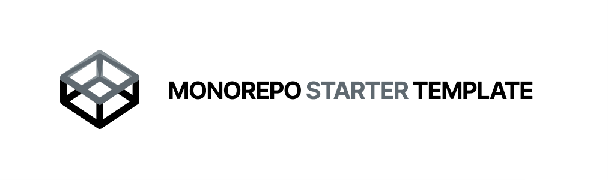

<h1>Monorepo starter template</h1>

Host multiple applications with automated independent package versioning using [conventional commits](https://www.conventionalcommits.org/) and native [NPM workspace](https://docs.npmjs.com/cli/v7/using-npm/workspaces).

## 💥 Features

- 📦 Native NPM Workspaces
- ✨ Host Multiple Apps, Component Libraries, API's
- 🏷️ Auto generate github [`releases`](https://github.com/emunhoz/monorepo-starter/releases) and [`tags`](https://github.com/emunhoz/monorepo-starter/tags) with descriptions
- 📝 Auto updates [`CHANGELOG.md`](https://github.com/emunhoz/monorepo-starter/blob/main/packages/ui/CHANGELOG.md) files for each package
- ⛓️ Automatically updates the version of dependencies in the [`package.json`](https://github.com/emunhoz/monorepo-starter/blob/main/packages/ui/package.json#L4) file generated by the `releases` and `tags` versions.

## 🚀 Start

In the root folder run following commands:

1. Install dependencies

```bash
  npm i
```

2. Run your project
```bash
  # npm start -w appName  # Run build and watch for changes for specific package
  npm run dev -w ui
```

## ⚠️ Requirements

- Node >= `v18.12.1`
- NPM >= `8.19.2`
- Each new package should have at least:
```json
  "name": "@your-project",
  "private": true,
  "version": "0.0.1",
```

You can also could create a new workflow to release `npm libraries`

_You need to add a new variable secrets `GH_TOKEN` in your github repository. This is required so that Semantic Release can publish a new release to the Github repository._

## 📦 Adding a new app

Do the same thing that you are used to.
e.g.

1 . Go to `packages/` folder

2 . Run

```bash
  npm create vite@latest
  # or
  yarn create next-app
```

## 🌐 Demo

[Spotifood](https://github.com/emunhoz/spotifood)

[Find movies](https://github.com/emunhoz/find-movies)
